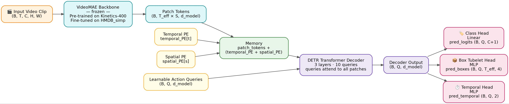

# Action Recognition Using Vision Transformers

Video action **classification** (VideoMAE, TimeSFormer) and spatio‑temporal action **localisation** (a DETR‑style detector built on a frozen VideoMAE backbone) on the HMDB51 and JHMDB datasets. This repository was built for an Advanced Machine Learning coursework project structured into five parts (A–E); each part is referenced below next to the results it produced.



## Contents

- [Overview](#overview)
- [Repository structure](#repository-structure)
- [Datasets](#datasets)
- [Setup](#setup)
- [Usage](#usage)
- [Results](#results)
  - [Part A — Backbone comparison](#part-a--backbone-comparison-video-classification)
  - [Part B — Ablation study (VideoMAE)](#part-b--ablation-study-videomae)
  - [Part C.1 — Multi-seed robustness](#part-c1--multi-seed-robustness-videomae)
  - [Part D — Spatio-temporal action localisation](#part-d--spatio-temporal-action-localisation-detr-style-jhmdb)
  - [Part E — Interpretability](#part-e--interpretability--error-analysis)
- [Reproducibility notes](#reproducibility-notes)


## Overview

| Task | Model(s) | Dataset | Script(s) |
|---|---|---|---|
| Task 1 — Action classification | VideoMAE (`MCG-NJU/videomae-base-finetuned-kinetics`), TimeSFormer (`facebook/timesformer-base-finetuned-k400`) | HMDB_simp (25 classes) | `scripts/train_classifier.py`, `scripts/evaluate_classifier.py` |
| Task 2 — Spatio-temporal action localisation | DETR-style detector on a frozen VideoMAE backbone | JHMDB_simp (21 classes) | `scripts/train_localisation.py`, `scripts/evaluate_localisation.py` |

Both classification backbones are Hugging Face checkpoints pretrained on Kinetics-400, fine‑tuned end‑to‑end on HMDB_simp. The localisation head reuses the Part A VideoMAE weights (frozen) and adds a transformer decoder with learnable object queries plus classification, bounding‑box, and temporal‑extent prediction heads (`models/detection/detr_head.py`).

## Repository structure

```
configs/            Base + model-specific YAML configs (base.yaml, videomae.yaml, timesformer.yaml)
data/                HMDB / JHMDB PyTorch Dataset loaders
models/              VideoMAE, TimeSFormer wrappers + DETR-style detection head
training/            Optimizer, LR scheduler, losses (incl. DETR set-prediction loss), early stopping, trainer
evaluation/          Classification metrics, localisation metrics (frame/video AP & mAP), plotting utilities
scripts/             Entry points: train/evaluate classifier, ablation, multi-seed eval, train/evaluate localisation,
                     interpretability, checkpoint downloader
utils/               Run-directory helpers, misc utilities
outputs/             Generated metrics, plots, and JSON result files (created by the scripts above)
checkpoints/         Trained model weights (git-ignored; download separately, see Setup)
logs/                TensorBoard event files (git-ignored)
HMDB_simp/           Classification dataset (git-ignored; not included in the repo)
JHMDB_simp/          Localisation dataset (git-ignored; not included in the repo)
```

## Datasets

**HMDB_simp** — a 25-class subset of HMDB51 used for Task 1, 50 videos per class (1,250 videos total). Split 70% / 15% / 15% (train / val / test = 875 / 187 / 188 videos), stratified and seeded (`seed=42`) so the split is reproducible across runs.

Classes: `brush_hair, cartwheel, catch, chew, climb, climb_stairs, draw_sword, eat, fencing, flic_flac, golf, handstand, kiss, pick, pour, pullup, pushup, ride_bike, shoot_bow, shoot_gun, situp, smile, smoke, throw, wave`

**JHMDB_simp** — used for Task 2 (localisation) and for the cross-dataset interpretability analysis in Part E. 21 classes, 928 video clips, with per-frame bounding boxes derived from joint-position annotations (`.mat` files) and the official train/test splits shipped with JHMDB.

Classes: `brush_hair, catch, clap, climb_stairs, golf, jump, kick_ball, pick, pour, pullup, push, run, shoot_ball, shoot_bow, shoot_gun, sit, stand, swing_baseball, throw, walk, wave`

Neither dataset is bundled with the repository (they're git-ignored due to size — 2.2 GB / 212 MB respectively). Point `data.dataset_root` in the configs (or `--dataset_root` / `--jhmdb_root` on the CLI) at your local copies.

## Setup

```bash
python -m venv venv && source venv/bin/activate
pip install -r requirements.txt

# Trained checkpoints are hosted on Google Drive (too large for GitHub).
# Edit the file IDs in scripts/download_checkpoints.py if you're using your own Drive folder, then:
python scripts/download_checkpoints.py
```

This downloads `checkpoints/videomae_best.pt`, `checkpoints/timesformer_best.pt`, `checkpoints/detr_best.pt`, and the three multi-seed checkpoints (`seed_42.pt`, `seed_123.pt`, `seed_456.pt`).

## Usage

```bash
# Train a classifier
python scripts/train_classifier.py --config configs/videomae.yaml
python scripts/train_classifier.py --config configs/timesformer.yaml

# Evaluate a trained classifier on the HMDB_simp test split
python scripts/evaluate_classifier.py \
  --model_name videomae --checkpoint checkpoints/videomae_best.pt --config configs/videomae.yaml

# One-factor-at-a-time ablation (sampling / augmentation / scheduler) for VideoMAE
python scripts/run_ablation.py

# Multi-seed robustness check (seeds 42, 123, 456) for VideoMAE
python scripts/multi_seed_evaluation.py

# Interpretability: attention maps, cross-dataset t-SNE, temporal contribution
python scripts/interpretability.py --checkpoint checkpoints/videomae_best.pt

# Train / evaluate the DETR-style localisation head on JHMDB_simp
python scripts/train_localisation.py --jhmdb_root JHMDB_simp
python scripts/evaluate_localisation.py --checkpoint checkpoints/detr_best.pt --jhmdb_root JHMDB_simp
```

Every script writes its outputs (metrics JSON, plots, TensorBoard logs, or checkpoints) into a timestamped run directory under `outputs/<script_name>/<model>_<run_tag>_<timestamp>/`.

## Results

All numbers below are read directly from the JSON/log artifacts committed under `outputs/`, `logs/`, and `run_logs/` in this repository (not recomputed), cross-checked against each other where duplicated (e.g. the per-run `metrics.json` files agree with `ablation_results.json`). Test-set accuracy is measured on the 188-video HMDB_simp held-out test split unless stated otherwise.

### Part A — Backbone comparison (video classification)

| Model | Split | Top-1 | Top-5 | Macro-F1 | Params | GFLOPs/clip |
|---|---|---|---|---|---|---|
| **VideoMAE** (16 frames, uniform sampling, no augmentation) | Test (188 videos) | **90.43%** | 98.40% | 90.30% | 86.26M | 135.14 |
| TimeSFormer (8 frames, uniform sampling, no augmentation) | Test (188 videos) | 84.57% | 97.34% | 84.33% | 121.28M | 190.06 |

VideoMAE outperforms TimeSFormer by 5.86 pp Top-1 on the same test split, while also being the smaller and cheaper model (86.3M vs 121.3M params, 135.1 vs 190.1 GFLOPs/clip). TimeSFormer's best checkpoint (`checkpoints/timesformer_best.pt`) was selected on validation accuracy (from TensorBoard logs, `logs/timesformer/`); training accuracy reached 100% within a few epochs (fast overfitting on 875 training clips), consistent with it underperforming VideoMAE on the held-out test set.

Source: `outputs/evaluate_classifier/videomae_baseline_20260728_201611/metrics.json` (VideoMAE) and `outputs/evaluate_classifier/timesformer_20260731_230344/metrics.json` (TimeSFormer). Full per-class precision/recall/F1 and confusion matrices are available in those directories, and for every VideoMAE configuration listed below.

### Part B — Ablation study (VideoMAE)

One-factor-at-a-time ablation, each row is a full train+evaluate run on the same HMDB_simp split (source: `outputs/run_ablation/videomae_20260728_231028/ablation_results.json`, cross-checked against the corresponding `outputs/evaluate_classifier/*/metrics.json`):

| Factor | Setting | Top-1 | Top-5 | Macro-F1 |
|---|---|---|---|---|
| — | **Baseline** (uniform sampling, no augmentation, cosine LR) | 90.43% | 98.40% | 90.30% |
| Temporal sampling | random | 90.43% | 97.87% | 90.01% |
| Temporal sampling | dense | 88.30% | 96.81% | 88.17% |
| Augmentation | spatial | **92.02%** | 98.40% | **91.83%** |
| Augmentation | temporal | 88.30% | 97.87% | 88.16% |
| LR scheduler | step | 86.70% | 98.94% | 85.81% |
| LR scheduler | warmup_cosine | 91.49% | **99.47%** | 91.66% |

Takeaways: spatial augmentation gives the largest single improvement over the baseline (+1.6 pt top-1); dense sampling and temporal augmentation both hurt accuracy relative to uniform sampling / no augmentation; a step LR schedule underperforms cosine annealing, while warmup+cosine slightly improves on plain cosine.

### Part C.1 — Multi-seed robustness (VideoMAE)

Baseline configuration retrained from scratch with 3 seeds (source: `outputs/multi_seed_evaluation/videomae_20260729_032953/multi_seed_results.json`):

| Seed | Top-1 | Top-5 |
|---|---|---|
| 42 | 92.02% | 98.40% |
| 123 | 94.68% | 98.94% |
| 456 | 90.96% | 100.00% |
| **Mean ± std** | **92.55% ± 1.57** | **99.11% ± 0.66** |

Note the mean top-1 across seeds (92.55%) is noticeably higher than the single baseline run reported in Parts A/B (90.43%, seed 42 there vs. 92.02% for seed 42 here) — the two runs use the same hyperparameters and seed but are separate training runs, so the ~1.6 pt gap reflects run-to-run training variance rather than a configuration difference. Per-seed confusion matrices: `outputs/confusion_matrix_videomae_seed{42,123,456}.png`.

### Part D — Spatio-temporal action localisation (DETR-style, JHMDB)

The localisation head (`models/detection/detr_head.py`) was trained on JHMDB_simp for 30 epochs with a frozen VideoMAE backbone (`scripts/train_localisation.py`, default hyperparameters: batch size 4, 10 object queries, 16 frames/clip, lr 1e-4). Training converged (`logs/detr/`):

| Metric | Value |
|---|---|
| Final train loss (epoch 30) | 0.34 |
| Final val loss (epoch 30) | 1.88 |

`evaluation/localisation_metrics.py` implements 11-point-interpolated frame-AP, spatio-temporal IoU, and video-AP/mAP at IoU 0.5. `scripts/evaluate_localisation.py` was run against `checkpoints/detr_best.pt` at both the standard and a lowered confidence threshold:

| Detection setting | Frame-mAP@0.5 | Video-mAP@0.5 |
|---|---|---|
| Standard confidence threshold | 0.000 | 0.000 |
| Lowered confidence threshold | 0.010 | 0.069 |

(Source: `outputs/evaluate_localisation/detr_20260731_230354/localisation_metrics.json` and `outputs/evaluate_localisation/detr_lowthresh_20260731_230518/localisation_metrics.json`.)

At the standard threshold the model produces no confident detections at all — the classification branch assigns nearly every query to the background class, so no detection survives thresholding. Lowering the threshold recovers a small number of usable boxes; the only classes with non-zero frame-AP are `pullup` (0.119) and `swing_baseball` (0.091), both strongly periodic actions with a spatially stable, centred actor. This is a clear negative result: the head converges in training but fails to generalise, most likely due to extreme query/background class imbalance (10 queries, 1 ground-truth tube per clip), frozen classification-tuned backbone features, and a training schedule (30 epochs) far shorter than DETR-style set prediction typically needs. Do not treat the loss values above as a proxy for detection accuracy on their own — they are corroborating evidence the model trained without diverging, not a substitute for the mAP figures above.

### Part E — Interpretability & error analysis

Qualitative analysis of the VideoMAE classifier (`scripts/interpretability.py`, outputs under `outputs/interpretability/`):

- **Attention rollout, correct vs. incorrect predictions** — attention maps from transformer layer 11 compared between correctly and incorrectly classified test clips (`attention/attention_correct_vs_incorrect.png`).
- **Cross-dataset t-SNE** — t-SNE of CLS-token embeddings from the HMDB_simp and JHMDB test sets plotted together (circle = HMDB, cross = JHMDB, colour = class) to visualise how well class clusters transfer across datasets (`tsne_cross_dataset.png`).
- **Temporal contribution** — for a handful of JHMDB test videos, prediction confidence is tracked as more of the clip is revealed frame-by-frame, showing how early the model becomes confident relative to the ground-truth action span (`temporal/temporal_contrib_video{1..5}.png`).

These are qualitative visualisations rather than scalar metrics; no numeric interpretability score is reported.

## Reproducibility notes

- All classification runs use `seed=42` for the dataset split; ablation/multi-seed runs additionally seed model init and data shuffling per the experiment (`training.seed` in the merged config or the `--seeds` list).
- Training was run on a single CUDA GPU (`otter156.eps.surrey.ac.uk`, per TensorBoard/host metadata in the log filenames).
- GFLOPs and parameter counts are measured with `thop` inside `evaluation/metrics.py` at evaluation time, for a single clip of the model's native input size (VideoMAE: 16×224×224).


